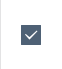

#### 作者

张明

#### 组件介绍

checkbox 选择框

#### 组件缩略图



#### 使用

```html
<sp-checkbox v-model="value"></sp-checkbox>
```

#### Props

| 参数                  | 类型              | 默认值 | 可选项                     | 备注                   |
| --------------------- | ----------------- | ------ | -------------------------- | ---------------------- |
| model-value / v-model | booleam \/ number | 1      | -                          | 选中项绑定值           |
| checked               | boolean           | false  | -                          | 当前是否勾选           |
| size                  | string            | normal | 'large', 'normal', 'small' | 设置计数器允许的最小值 |
| true-value            | boolean \/ number | true   | -                          | 选中时的值             |
| false-value           | boolean \/ number | false  | -                          | 没有选中时的值         |
| disabled              | boolean           | false  | -                          | 是否禁用               |

#### Slot

| name   | 回调参数 | 说明                     |
| ------ | -------- | ------------------------ |
| change | value    | 当绑定值变化时触发的事件 |
