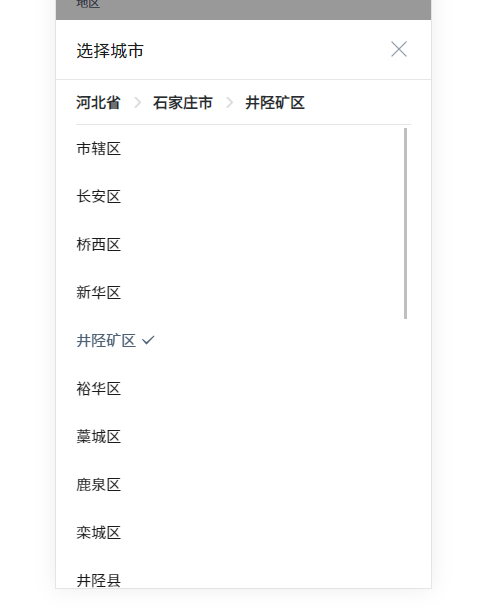

#### 作者

张明

#### 组件介绍

城市选择器

#### 组件缩略图



#### 使用

```
<sp-city-picker v-model="show"></sp-city-picker>
```

#### Props

| 参数                 | 类型            | 默认值 | 可选项     | 备注                                        |
| -------------------- | --------------- | ------ | ---------- | ------------------------------------------- |
| modelValue / v-model | boolean         | false  | true/false | 城市选择弹框状态，是否可见                  |
| value                | User.CityInfo[] | false  | true/false | 初始值                                      |
| pickLevel            | number          | 3      | -          | 省、市、区 选择最大层级，即最大选择到第几层 |
| hasLocation          | boolean         | false  | true/false | 是否有定位功能                              |
| isOrg                | boolean         | false  | true/false | 是否为关联组织区划的地区，调用线索接口      |

```ts
/**
 * User.CityInfo
 * @property text 城市名称
 * @property children 是否有子级
 * @property code 城市编码
 * @property id 城市id
 */
interface User.CityInfo {
  text: string
  children?: boolean
  code: string
  id: string
}
```

#### Methods

| 方法名 | 参数 | 返回值 | 备注 |
| ------ | ---- | ------ | ---- |
| close  |      |        |      |

#### Slot

| name | 说明 |
| ---- | ---- |
| -    |      |
