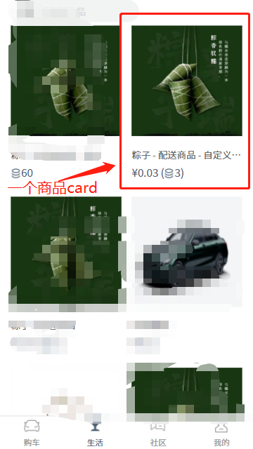

#### 作者

玄火

#### 组件介绍

一个展示商品的 card，主要展示主图、商品名、价格

#### 组件缩略图



#### 使用

```js
<sp-goods-card
    v-for="item in recommendList"
    :key="item.id"
    :goods-detail="item"
    :point-ratio="pointRatio"
    width="328"
></sp-goods-card>
```

#### Props

| 参数        | 类型          | 默认值 | 可选项 | 备注         |
| ----------- | ------------- | ------ | ------ | ------------ |
| goodsDetail | Goods.Item    | -      | -      | 单个商品数据 |
| point-ratio | Number        | -      | -      | 积分兑换比例 |
| width       | Number/String | 326    | -      | 卡片宽度     |
