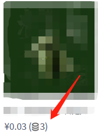

#### 作者

玄火

#### 组件介绍

展示价格、积分

#### 组件缩略图



#### 使用

```
<sp-goods-price font-size="32" color="#4e6175" :sku-detail="data" :point-ratio="pointRatio"></sp-goods-price>
```

#### Props

| 参数        | 类型          | 默认值  | 可选项           | 备注                        |
| ----------- | ------------- | ------- | ---------------- | --------------------------- |
| sku-detail  | Object        | -       | -                | sku 详情，看下面 sku-detail |
| point-ratio | Number        | -       | -                | 积分兑换比例                |
| font-size   | String/Number | 40      | -                | 字体的大小                  |
| color       | String        | #4e6175 | css 能识别的颜色 | 字体的颜色                  |

##### sku-detail

| 参数          | 类型          | 默认值 | 可选项 | 备注     |
| ------------- | ------------- | ------ | ------ | -------- |
| payType       | Number/String | -      | -      | 支付类型 |
| maxPointPrice | Number        | -      | -      |          |
| pointPrice    | Number        | -      | -      |          |
| price         | Number        | -      | -      |          |
| lowPrice      | Number        | -      | -      |          |
| extra         | Object        | -      | -      |          |

#### Methods

| 方法名 | 参数 | 返回值 | 备注 |
| ------ | ---- | ------ | ---- |
| -      |      |        |      |

#### Slot

| name | 说明 |
| ---- | ---- |
| -    |      |
