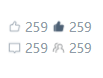

#### 作者

山而

#### 组件介绍

icon + 数字/文字 展示组件，适用于点赞数、评论数等显示。

#### 组件缩略图



#### 使用

```html
<sp-icon-number :value="259"></sp-icon-number>
```

#### Props

| 参数      | 类型   | 默认值  | 可选项                                                | 备注      |
| --------- | ------ | ------- | ----------------------------------------------------- | --------- |
| icon      | String |         |                                                       | 图标 icon |
| fontSize  | Number |         |                                                       | 字体大小  |
| color     | String |         |                                                       | 字体颜色  |
| direction | String | inherit | row/row-reverse/column/column-reverse/initial/inherit | 排列方式  |

#### Slot

| name | 说明           | 默认值 |
| ---- | -------------- | ------ |
| -    | 自定义显示内容 |        |
