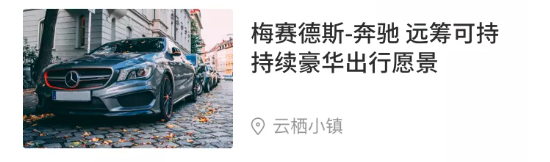

#### 作者

山而

#### 组件介绍

左侧图片右侧文字卡片

#### 组件缩略图



#### 使用

```
<sp-image-card :image="" :title="" :subtitle="" :icon=""></sp-image-card>
```

或者

```
<sp-image-card :image="" :title="">
    // 副标题内容
</sp-image-card>
```

#### Props

| 参数     | 类型          | 默认值 | 可选项 | 备注               |
| -------- | ------------- | ------ | ------ | ------------------ |
| image    | String        |        |        | 左侧图片地址       |
| title    | String/Number |        |        | 右侧 title         |
| subtitle | String/Number |        |        | 右侧 subtitle      |
| icon     | String        |        |        | 右侧 subtitle icon |

#### Slot

| name | 说明                     |
| ---- | ------------------------ |
| -    | 副标题 subtitle 部分内容 |
