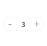

#### 作者

张明

#### 组件介绍

数字输入框

#### 组件缩略图



#### 使用

```html
<sp-input-number v-model="number"></sp-input-number>
```

#### Props

| 参数                  | 类型    | 默认值 | 可选项 | 备注                   |
| --------------------- | ------- | ------ | ------ | ---------------------- |
| model-value / v-model | number  | 1      | -      | 选中项绑定值           |
| value                 | number  | 1      | -      | 选中项初始值           |
| min                   | number  | 1      | -      | 设置计数器允许的最小值 |
| max                   | number  | 100    | -      | 设置计数器允许的最大值 |
| step                  | number  | 1      | -      | 计数器步长             |
| disabled              | boolean | false  | -      | 是否禁用计数器         |
| is-disabled-input     | boolean | false  | -      | 是否禁用输入框         |

#### Methods

| 方法名 | 回调参数                                    | 备注               |
| ------ | ------------------------------------------- | ------------------ |
| change | (currentValue: number, oldValue: number)    | 绑定值被改变时触发 |
| error  | (errorType: 'moreThanMax' \| 'lessThanMin') | 输入值异常时触发   |
