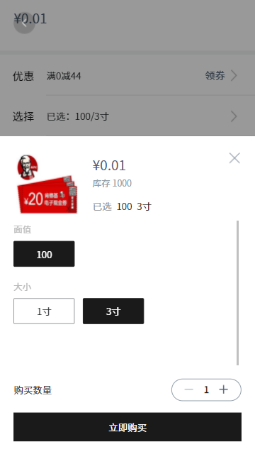

#### 作者

玄火

#### 组件介绍

弹窗-选择商品 sku

#### 组件缩略图



#### 使用

```js
// 方法一
<sp-select-sku
    ref="spSelectSkuRef"
    :pointRatio="pointRatio"
    :skuId="currentSku.skuId"
    :goods-detail="goodsDetail"
    :need-immediate-change="true"
    @sku-change="handleSkuChange"
    @add-cart="handleAddCart"
    @buy="handleBuy"
></sp-select-sku>

let spSelectSkuRef = <AnyObject>this.$refs.spSelectSkuRef
spSelectSkuRef.open(operateType)

// 方法二
let spSelectSkuRef = <AnyObject>this.$refs.spSelectSkuRef
spSelectSkuRef.open(operateType, skuId, goodsDetail)
```

#### Props

| 参数                  | 类型    | 默认值 | 可选项                                     | 备注 |
| --------------------- | ------- | ------ | ------------------------------------------ | ---- |
| pointRatio            | Number  | -      | 积分兑换比                                 |
| need-immediate-change | Boolean | -      | 切换 sku 时，是否需要 emit sku-change 事件 |
| skuId                 | Number  | -      | 当前选中的 sku id                          |
| goods-detail          | Object  | -      | 商品详情                                   |

#### Methods

| 方法名 | 参数      | 返回值 | 备注     |
| ------ | --------- | ------ | -------- |
| open   | openProps | -      | 打开弹窗 |

##### openProps

| 参数名       | 类型   | 返回值 | 备注                                |
| ------------ | ------ | ------ | ----------------------------------- |
| operate-type | ENUM   | -      | addCart、buy、selectSku、selectSku2 |
| skuId        | Number | -      | 当前选中的 sku id                   |
| goods-detail | Object | -      | 商品详情                            |
