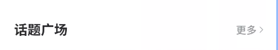

#### 作者

山而

#### 组件介绍

带有右侧操作的标题条组件

#### 组件缩略图



#### 使用

```html
<sp-title-bar :title="" :btn-text=""></sp-title-bar>
```

#### Props

| 参数         | 类型    | 默认值 | 可选项     | 备注             |
| ------------ | ------- | ------ | ---------- | ---------------- |
| title        | String  |        |            | 标题信息         |
| fontSize     | String  |        |            | 标题字体大小     |
| color        | String  |        |            | 标题字体颜色     |
| btnText      | String  |        |            | 右侧按钮文字     |
| btnFontSize  | String  |        |            | 右侧按钮文字大小 |
| btnTextColor | String  |        |            | 右侧按钮文字颜色 |
| hidenBtn     | Boolean | false  | false/true | 隐藏右侧操作按钮 |

#### Methods

| 方法名  | 参数 | 返回值 | 备注         |
| ------- | ---- | ------ | ------------ |
| onClick |      |        | 右侧按钮点击 |
